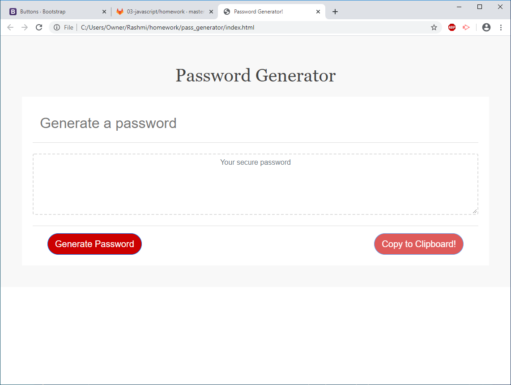

# The Repository
This repository is about generating a password. It is responsive in nature for large, medium and small screens. 

## Installation:
This project uses HTML, CSS with Bootstrap and JavaScript.
The code editor used here is VScode. Version controller is Github.

## Usage:
- Password generator generates random password based on user-selected criteria. This app will run in the browser and feature dynamically updated HTML and CSS powered by your JavaScript code.The user will be prompted to select mainly: 
    - **Length**: Length of the password .
    - **Character Type**: What kind of characters(special, number, lowercase or uppercase) user wants in the password .
Also one can copy the password to the clipboard.

## Deployed link:
[a link] (https://graphicaction.github.io/pass_generator/)

## Credits:
UNC Chapelhill

## License
Copyright (c). All rights reserved.